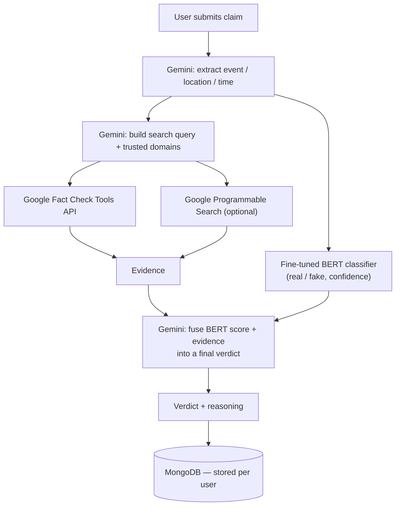

# TruthSeeker

TruthSeeker takes a free-text claim and returns a verdict — **True / False / Misleading / Unverified** — backed by real evidence and a hybrid AI pipeline, with live progress streamed to the browser over WebSockets as each stage runs.

Live demo: https://claim-verifier-4sjg.vercel.app

## Architecture

A submitted claim moves through five stages. Each stage's start is broadcast to the frontend over WebSocket so the UI can show live progress (extracting → building query → searching → analyzing → done) instead of a single opaque loading spinner.



**Why a hybrid pipeline, not just one model call:**

- A single LLM call over a claim with no evidence is easy to fool and impossible to audit. TruthSeeker instead retrieves real fact-check articles and news evidence *first*, then asks the LLM to reason over that evidence rather than guess from parametric memory alone.
- A fine-tuned classifier (BERT, trained on the LIAR dataset — see below) adds a second, independent signal grounded in the statement's own phrasing and framing, which the LLM fusion step weighs alongside the retrieved evidence.
- Every external call (Gemini, Fact Check Tools API, the BERT service) degrades gracefully: if any one is unavailable or returns nothing, the pipeline still produces a verdict from whatever signal it does have, rather than failing outright.

## Machine Learning Model

The classification model is a `bert-base-uncased` checkpoint fine-tuned on the [LIAR dataset](https://www.cs.ucsb.edu/~william/data/liar_dataset.zip) (Wang, 2017 — *"Liar, Liar Pants on Fire": A New Benchmark Dataset for Fake News Detection*), a widely-used benchmark of ~12,800 short political statements labeled on a six-point truthfulness scale.

- **Label collapse**: the six original labels (`pants-fire`, `false`, `barely-true`, `half-true`, `mostly-true`, `true`) are collapsed to binary `fake` / `real` at the midpoint, to match the pipeline's use of the model as one input signal rather than a standalone verdict.
- **Training**: 3 epochs, `bert-base-uncased`, fine-tuned via Hugging Face `Trainer` — see [`training/train_bert_liar.ipynb`](training/train_bert_liar.ipynb) (Colab-ready, GPU required).
- **Held-out test set results**: **65.2% accuracy, 71.5% F1**. This is in line with published text-only baselines on LIAR — the dataset asks a model to judge truthfulness from a short, isolated statement with no surrounding context or evidence, which has a well-documented ceiling in the literature. This is also the practical justification for not relying on the classifier alone: it is one signal fused with real retrieved evidence, not the final word.
- **Serving**: the fine-tuned weights are published on the [Hugging Face Hub](https://huggingface.co/annwesa65/truthseeker-bert-liar) and served from a small Gradio app on Hugging Face Spaces (`bert_api.py`), loaded with `low_cpu_mem_usage=True` and dynamic INT8 quantization to fit a free CPU instance.

## Security Features

- **Password hashing** — bcrypt, 10 salt rounds
- **JWT authentication** — 7-day tokens; the server refuses to start if `JWT_SECRET` is unset, rather than falling back to a guessable default
- **CORS locked to configured origins** — both the HTTP API and the WebSocket upgrade reject any origin not explicitly listed in `FRONTEND_ORIGIN`
- **`helmet`** — standard secure HTTP headers
- **`express-mongo-sanitize`** — strips Mongo operator injection from request input
- **Tiered rate limiting** — a global limiter on all routes, plus a stricter limiter specifically on `/api/auth` to resist credential brute-forcing
- **User data isolation** — verification history is scoped per authenticated user; every read/write is filtered by the requester's own email
- **Zero known dependency vulnerabilities** (`npm audit`) — Puppeteer, previously used for scraping, was removed entirely in favor of official APIs, which also removed its vulnerable transitive dependency tree

## Setup Instructions

### Backend Setup

1. Navigate to the backend directory:

   ```bash
   cd backend
   ```

2. Install dependencies:

   ```bash
   npm install
   ```

3. Create a `.env` file in the backend directory (see `backend/.env.example` for the full list with descriptions):

   ```
   MONGODB_URI=your_mongodb_connection_string
   JWT_SECRET=your_long_random_jwt_secret
   GEMINI_API_KEY=your_gemini_api_key
   GEMINI_MODEL=gemini-2.5-flash
   GOOGLE_FACTCHECK_API_KEY=your_google_factcheck_api_key
   FRONTEND_ORIGIN=http://localhost:5173
   BERT_API_URL=http://localhost:5001
   ```

4. Start the backend server:

   ```bash
   npm start
   ```

### Frontend Setup

1. Navigate to the frontend directory:

   ```bash
   cd frontend
   ```

2. Install dependencies:

   ```bash
   npm install
   ```

3. Start the frontend development server:
   ```bash
   npm run dev
   ```

### BERT model service (optional locally, required in production)

The Node backend calls out to a separately hosted BERT inference service; without it, `BERT_API_URL` simply fails gracefully and the pipeline falls back to evidence + Gemini alone. To run or redeploy the model service itself, see `bert_api.py`, `requirements.txt`, and `training/train_bert_liar.ipynb` at the repo root.

## Deployment

| Component | Hosted on |
|---|---|
| Frontend (React + Vite) | Vercel |
| Backend (Node/Express + WebSocket) | Render |
| BERT model service (Gradio) | Hugging Face Spaces |
| Database | MongoDB Atlas |

## Usage

1. **Sign Up**: Visit `/signup` to create a new account
2. **Login**: Visit `/login` to sign in to your account
3. **Submit Claims**: Only logged-in users can submit claims for verification
4. **View Logs**: Each user sees only their own verification history
5. **Navigation**: The navigation bar will show Login/Signup when not authenticated, and Logout with user name when authenticated
6. **Logout**: Click the Logout button to sign out

## API Endpoints

### Authentication Endpoints

#### POST /api/auth/signup

Create a new user account.

**Request Body:**

```json
{
  "name": "John Doe",
  "email": "john@example.com",
  "password": "password123"
}
```

**Response:**

```json
{
  "message": "User created successfully",
  "token": "jwt_token_here",
  "user": {
    "id": "user_id",
    "email": "john@example.com",
    "name": "John Doe"
  }
}
```

#### POST /api/auth/login

Sign in to an existing account.

**Request Body:**

```json
{
  "email": "john@example.com",
  "password": "password123"
}
```

**Response:**

```json
{
  "message": "Login successful",
  "token": "jwt_token_here",
  "user": {
    "id": "user_id",
    "email": "john@example.com",
    "name": "John Doe"
  }
}
```

#### GET /api/auth/profile

Get user profile (requires authentication).

**Headers:**

```
Authorization: Bearer jwt_token_here
```

**Response:**

```json
{
  "user": {
    "id": "user_id",
    "email": "john@example.com",
    "name": "John Doe",
    "createdAt": "2024-01-01T00:00:00.000Z"
  }
}
```

### Verification Endpoints (Protected)

#### POST /api/verify-event

Submit a claim for verification (requires authentication).

**Headers:**

```
Authorization: Bearer jwt_token_here
```

**Request Body:**

```json
{
  "claim": "There was an earthquake in California yesterday"
}
```

**Response:**

```json
{
  "claim": "There was an earthquake in California yesterday",
  "extraction": { "event": "earthquake", "location": "California", "time": "yesterday" },
  "evidence": [...],
  "verification": { "result": "True", "reasoning": "..." },
  "bertResult": { "label": "real", "confidence": 0.74 },
  "id": "verification_event_id"
}
```

#### GET /api/verify-event/logs

Get user's verification history (requires authentication).

**Headers:**

```
Authorization: Bearer jwt_token_here
```

**Response:**

```json
[
  {
    "_id": "event_id",
    "claim": "There was an earthquake in California yesterday",
    "extraction": { "event": "earthquake", "location": "California", "time": "yesterday" },
    "evidence": [...],
    "verification": { "result": "True", "reasoning": "..." },
    "userEmail": "john@example.com",
    "createdAt": "2024-01-01T00:00:00.000Z"
  }
]
```

## File Structure

```
├── backend/
│   ├── agents/
│   │   └── gemini.js            # Extraction, search-query building, evidence fusion
│   ├── models/
│   │   ├── User.js
│   │   └── VerificationEvent.js
│   ├── routes/
│   │   ├── auth.js
│   │   └── verifyEvent.js       # Orchestrates the full verification pipeline
│   ├── utils/
│   │   ├── auth.js
│   │   ├── db.js
│   │   ├── scraper.js           # Fact Check Tools API + optional Custom Search
│   │   └── searchQueryBuilder.js
│   ├── app.js                   # Express app, WebSocket server, security middleware
│   └── .env.example
├── bert_api.py                  # BERT inference service (Gradio, hosted on HF Spaces)
├── requirements.txt              # Python deps for bert_api.py
├── training/
│   └── train_bert_liar.ipynb    # Colab notebook: fine-tune + push to Hugging Face Hub
└── frontend/
    ├── src/
    │   ├── components/
    │   │   ├── LoginPage.jsx / SignupPage.jsx
    │   │   ├── LandingPage.jsx / VerifyPage.jsx / LogsPage.jsx
    │   │   └── ui/
    │   ├── context/
    │   │   └── AuthContext.jsx
    │   ├── lib/
    │   │   └── config.js        # API_URL / WS_URL resolution
    │   └── App.jsx
    └── package.json
```

## Database Changes

The `VerificationEvent` model includes a `userEmail` field, associating each verification event with the user who submitted it. This allows for:

- **User-specific logs**: Each user only sees their own verification history
- **Data isolation**: Complete separation of user data
- **Audit trail**: Track which user submitted each verification request
